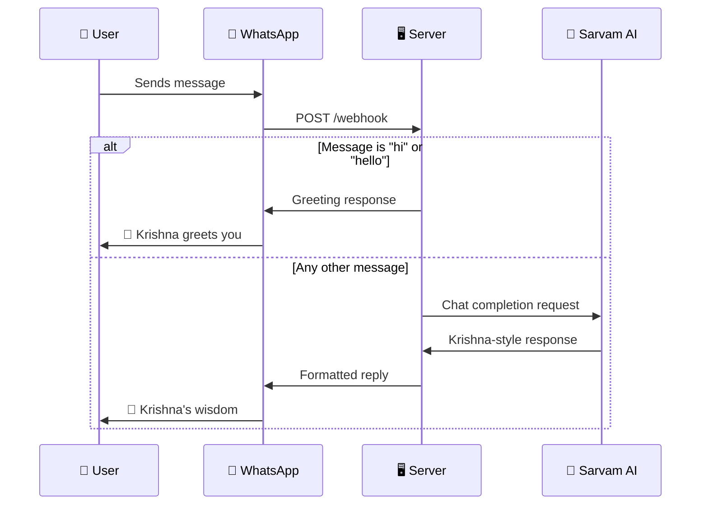

<div align="center">

<!-- Decorative Top Banner -->


<br/>

<!-- Animated Typing SVG -->
<a href="https://git.io/typing-svg">
  
</a>

<br/><br/>

<!-- Badges Row 1: Tech Stack -->


<br/>

<!-- Badges Row 2: Repo Stats -->


<br/><br/>

<!-- Tagline -->
> *"Whenever dharma declines and the purpose of life is forgotten, I manifest myself on earth."*
> — **Bhagavad Gita 4.7**

<br/>

<!-- Divider -->


</div>

## 📑 Table of Contents

<details>
<summary>Click to expand</summary>

- [What is Bhartiya Bot?](#-what-is-bhartiya-bot)
- [Features](#-features)
- [Demo](#-demo)
- [Architecture](#-architecture)
- [Tech Stack](#-tech-stack)
- [Quick Start](#-quick-start)
- [Environment Variables](#-environment-variables)
- [Deployment](#-deployment)
- [Project Structure](#-project-structure)
- [How It Works](#-how-it-works)
- [Sample Conversations](#-sample-conversations)
- [Troubleshooting](#-troubleshooting)
- [Roadmap](#-roadmap)
- [Contributing](#-contributing)
- [License](#-license)
- [Author](#-author)
- [Acknowledgements](#-acknowledgements)

</details>

---

## 🪷 What is Bhartiya Bot?

**Bhartiya Bot** is an AI-powered WhatsApp chatbot that **embodies Lord Krishna**, offering spiritual guidance rooted in the timeless wisdom of the **Bhagavad Gita**. Simply message the bot with any life question, and receive personalized, compassionate advice — complete with authentic Sanskrit shlokas and their meanings.

<div align="center">

```
  🙏 You ask a question about life
        ⬇️
  🪷 Krishna responds with wisdom
        ⬇️
  📖 Backed by real Gita verses
        ⬇️
  🕉️ Sanskrit shlokas + meanings
        ⬇️
  💡 Practical guidance for YOU
```

</div>

---

## ✨ Features

<div align="center">

| Feature | Description |
|:---:|---|
| 🙏 **Divine Persona** | Speaks as Lord Krishna, addressing you as "Parth" (Arjuna) |
| 📖 **Authentic Verses** | Cites real Bhagavad Gita verses with chapter & verse numbers |
| 🕉️ **Sanskrit Shlokas** | Includes original Sanskrit text with simple translations |
| 🌍 **Multilingual** | Responds in the same language you message in — Hindi, English, and more |
| 💬 **Contextual Wisdom** | Maps ancient teachings to your modern-day challenges |
| ⚡ **Instant Responses** | Powered by Sarvam AI's `sarvam-m` model for fast, accurate replies |
| 🔒 **Secure** | All API keys stored as environment variables, never hardcoded |
| 🚀 **Easy Deploy** | Single-file architecture, deployable to any Node.js host |

</div>

---

## 🎬 Demo

<div align="center">

### 💬 Live Conversation Preview

```
╔══════════════════════════════════════════════════════════╗
║  📱 WhatsApp — Bhartiya Bot                              ║
╠══════════════════════════════════════════════════════════╣
║                                                          ║
║  👤 You:                                                 ║
║  ┌─────────────────────────────────┐                     ║
║  │ I'm stressed about my exams    │                      ║
║  └─────────────────────────────────┘                     ║
║                                                          ║
║                        🪷 Krishna says:                  ║
║         ┌────────────────────────────────────────┐       ║
║         │ Parth, when the mind is clouded by     │       ║
║         │ anxiety, remember that worry drains    │       ║
║         │ your energy without solving the        │       ║
║         │ problem.                               │       ║
║         │                                        │       ║
║         │ As I declared in the Bhagavad Gita     │       ║
║         │ (Chapter 6, Verse 35):                 │       ║
║         │                                        │       ║
║         │ असंशयं महाबाहो मनो दुर्निग्रहं चलम् ।      │       ║
║         │ अभ्यासेन तु कौन्तेय वैराग्येण च गृह्यते ॥   │       ║
║         │                                        │       ║
║         │ 📝 The mind is restless, but it can    │       ║
║         │ be mastered through practice and       │       ║
║         │ detachment.                            │       ║
║         │                                        │       ║
║         │ Focus on preparation with dedication,  │       ║
║         │ release the anxiety about results. 🙏  │       ║
║         └────────────────────────────────────────┘       ║
║                                                          ║
╚══════════════════════════════════════════════════════════╝
```

</div>

> **Want to try it live?** Follow the [Quick Start](#-quick-start) guide to set up your own instance!

---

## 🏗️ Architecture

<div align="center">

```
                          ┌─────────────────────────────────────────┐
                          │           BHARTIYA BOT SERVER            │
                          │           (Express.js + Node)            │
                          │                                         │
┌──────────┐   Message    │  ┌─────────┐    ┌──────────────────┐   │    ┌──────────────┐
│          │─────────────▶│  │ Webhook │───▶│ Message Router   │   │    │              │
│ WhatsApp │              │  │ Handler │    │                  │   │    │  Sarvam AI   │
│   User   │              │  │         │    │ ┌──────────────┐ │   │───▶│  (sarvam-m)  │
│  📱      │◀─────────────│  │ GET  ── │    │ │ "hi"/"hello" │ │   │◀───│              │
│          │   Response   │  │ verify  │    │ │  → Greeting  │ │   │    │  🧠 AI API   │
└──────────┘              │  │         │    │ ├──────────────┤ │   │    └──────────────┘
                          │  │ POST ── │    │ │ Other text   │ │   │
                          │  │ message │    │ │  → Sarvam AI │ │   │
                          │  └─────────┘    │ └──────────────┘ │   │
                          │                 └──────────────────┘   │
                          └─────────────────────────────────────────┘
                                         │
                              ┌──────────┴──────────┐
                              │  WhatsApp Cloud API  │
                              │  (Meta Graph v22.0)  │
                              └─────────────────────┘
```

</div>

### 🔄 Request Flow



---

## 🛠️ Tech Stack

<div align="center">

| Layer | Technology | Version | Purpose |
|:---:|:---:|:---:|---|
| ⚙️ **Runtime** |  | v18+ | JavaScript runtime |
| 🌐 **Framework** |  | v5.x | Web server & routing |
| 📡 **HTTP Client** |  | v1.x | API requests |
| 💬 **Messaging** |  | v22.0 | Send & receive messages |
| 🧠 **AI Engine** |  | sarvam-m | Spiritual response generation |
| 🔐 **Config** |  | v17.x | Environment variable management |

</div>

---

## 🚀 Quick Start

### Prerequisites

<table>
<tr>
<td>

**Required**
- ✅ [Node.js](https://nodejs.org/) v18 or higher
- ✅ [npm](https://www.npmjs.com/) (comes with Node.js)
- ✅ A [Meta Developer Account](https://developers.facebook.com/)
- ✅ A [Sarvam AI](https://sarvam.ai/) API key

</td>
<td>

**Recommended**
- 📦 [Git](https://git-scm.com/) for cloning
- 🌐 [ngrok](https://ngrok.com/) for local testing
- 🖥️ A cloud host (Render, Railway, etc.)

</td>
</tr>
</table>

### Step-by-Step Setup

<details>
<summary><b>1️⃣ Clone the Repository</b></summary>

```bash
git clone https://github.com/rahul-kumar-362/bhartiya-bot.git
cd bhartiya-bot
```

</details>

<details>
<summary><b>2️⃣ Install Dependencies</b></summary>

```bash
npm install
```

</details>

<details>
<summary><b>3️⃣ Configure Environment Variables</b></summary>

Copy the example file and fill in your credentials:

```bash
cp .env.example .env
```

Edit `.env` with your values:

```env
WHATSAPP_TOKEN=your_whatsapp_cloud_api_token
WHATSAPP_PHONE_ID=your_whatsapp_phone_number_id
WEBHOOK_VERIFY_TOKEN=your_custom_verify_token
SARVAM_API_KEY=your_sarvam_ai_api_key
PORT=3000
```

> ⚠️ **Security:** Never commit your `.env` file. It's already in `.gitignore`.

</details>

<details>
<summary><b>4️⃣ Start the Server</b></summary>

```bash
npm start
```

You should see:

```
Bot running on port 3000
```

</details>

<details>
<summary><b>5️⃣ Expose with ngrok (for local development)</b></summary>

In a new terminal:

```bash
ngrok http 3000
```

Copy the `https://` forwarding URL — you'll need it for the webhook.

</details>

<details>
<summary><b>6️⃣ Configure WhatsApp Webhook</b></summary>

1. Go to [Meta Developer Dashboard](https://developers.facebook.com/)
2. Select your app → **WhatsApp** → **Configuration**
3. Under **Webhook**:
   - **Callback URL:** `https://your-domain.com/webhook`
   - **Verify token:** same as your `WEBHOOK_VERIFY_TOKEN`
4. Click **Verify and Save**
5. Subscribe to the **`messages`** webhook field

✅ You should see `"Webhook verified successfully"` in your server logs.

</details>

---

## 🔐 Environment Variables

| Variable | Required | Description | Where to Get |
|---|:---:|---|---|
| `WHATSAPP_TOKEN` | ✅ | WhatsApp Cloud API access token | [Meta Developer Dashboard](https://developers.facebook.com/) → Your App → API Setup |
| `WHATSAPP_PHONE_ID` | ✅ | WhatsApp business phone number ID | Meta Dashboard → WhatsApp → API Setup → Phone number ID |
| `WEBHOOK_VERIFY_TOKEN` | ✅ | Custom string to verify webhook | Choose any secure string |
| `SARVAM_API_KEY` | ✅ | Sarvam AI API key | [Sarvam AI Dashboard](https://sarvam.ai/) |
| `PORT` | ❌ | Server port (default: `3000`) | — |

---

## ☁️ Deployment

<details>
<summary><b>🚂 Deploy on Railway</b></summary>

1. Fork this repository
2. Go to [Railway](https://railway.app/) and create a new project
3. Select **"Deploy from GitHub repo"** and pick your fork
4. Add environment variables in the Railway dashboard
5. Railway auto-detects Node.js and runs `npm start`
6. Use the generated URL as your webhook callback

[](https://railway.app/template/ZweBXA)

</details>

<details>
<summary><b>🟣 Deploy on Render</b></summary>

1. Fork this repository
2. Go to [Render](https://render.com/) → **New Web Service**
3. Connect your GitHub repo
4. Settings:
   - **Build Command:** `npm install`
   - **Start Command:** `npm start`
5. Add environment variables
6. Deploy and use the Render URL as your webhook

</details>

<details>
<summary><b>🔵 Deploy on Heroku</b></summary>

```bash
# Install Heroku CLI, then:
heroku create bhartiya-bot
heroku config:set WHATSAPP_TOKEN=your_token
heroku config:set WHATSAPP_PHONE_ID=your_phone_id
heroku config:set WEBHOOK_VERIFY_TOKEN=your_verify_token
heroku config:set SARVAM_API_KEY=your_sarvam_key
git push heroku main
```

</details>

<details>
<summary><b>🐳 Deploy with Docker</b></summary>

Create a `Dockerfile`:

```dockerfile
FROM node:18-alpine
WORKDIR /app
COPY package*.json ./
RUN npm ci --only=production
COPY . .
EXPOSE 3000
CMD ["npm", "start"]
```

Then build and run:

```bash
docker build -t bhartiya-bot .
docker run -p 3000:3000 --env-file .env bhartiya-bot
```

</details>

---

## 📁 Project Structure

```
bhartiya-bot/
│
├── 📄 server.js           # Main application — webhook handler + AI integration
├── 📦 package.json         # Project metadata & dependencies
├── 🔒 package-lock.json    # Locked dependency tree
├── 🔑 .env.example         # Template for environment variables
├── 🚫 .gitignore           # Git ignore rules
└── 📖 README.md            # This file
```

---

## ⚙️ How It Works

<div align="center">

```
┌─────────────────────────────────────────────────────────┐
│                    MESSAGE FLOW                          │
├─────────────────────────────────────────────────────────┤
│                                                         │
│   📱 User sends WhatsApp message                        │
│       │                                                 │
│       ▼                                                 │
│   📨 Meta delivers to POST /webhook                     │
│       │                                                 │
│       ▼                                                 │
│   🔍 Extract message text & sender                      │
│       │                                                 │
│       ├── "hi" / "hello"                                │
│       │       │                                         │
│       │       ▼                                         │
│       │   🪷 Send greeting:                             │
│       │   "Greetings, dear soul.                        │
│       │    What troubles your heart?"                   │
│       │                                                 │
│       └── Any other message                             │
│               │                                         │
│               ▼                                         │
│           🧠 Send to Sarvam AI with Krishna persona     │
│               │                                         │
│               ▼                                         │
│           📖 AI responds with:                          │
│              • Compassionate guidance                   │
│              • Real Gita verse (chapter:verse)          │
│              • Sanskrit shloka                          │
│              • Simple meaning                           │
│              • Practical application                    │
│               │                                         │
│               ▼                                         │
│           💬 Reply sent via WhatsApp Cloud API           │
│                                                         │
└─────────────────────────────────────────────────────────┘
```

</div>

---

## 💬 Sample Conversations

<table>
<tr>
<td width="50%">

### 🇬🇧 English

**You:** *I feel lost in life*

**🪷 Krishna says:**

> Parth, when the mind is clouded by doubt, the path appears unclear. Yet confusion arises only when one forgets one's true nature.
>
> As I declared in the Bhagavad Gita (Chapter 2, Verse 47):
>
> *कर्मण्येवाधिकारस्ते मा फलेषु कदाचन।*
> *मा कर्मफलहेतुर्भूर्मा ते सङ्गोऽस्त्वकर्मणि॥*
>
> **Meaning:** You have the right to perform your duty, but not to the fruits of your actions.
>
> Act with faith and steadiness. I am always guiding you from within. 🙏

</td>
<td width="50%">

### 🇮🇳 Hindi

**You:** *Mujhe darr lag raha hai*

**🪷 Krishna says:**

> Parth, jab man bhay se ghir jata hai, tab buddhi spasht nahi dekh pati.
>
> As I declared in the Bhagavad Gita (Chapter 2, Verse 20):
>
> *न जायते म्रियते वा कदाचिन्*
> *नायं भूत्वा भविता वा न भूयः।*
>
> **Meaning:** The soul is never born, nor does it ever die.
>
> Isliye he Parth, nishchint ho kar jeevan ka samna karo. Main hamesha tumhare saath hoon. 🙏

</td>
</tr>
</table>

---

## 🔧 Troubleshooting

<details>
<summary><b>❌ Webhook verification fails (403)</b></summary>

- Ensure `WEBHOOK_VERIFY_TOKEN` in `.env` matches the token in Meta Dashboard
- Check that your server is publicly accessible (use ngrok for local dev)
- Verify the URL ends with `/webhook`

</details>

<details>
<summary><b>❌ Bot doesn't respond to messages</b></summary>

- Check server logs for errors (`console.log` outputs)
- Verify `WHATSAPP_TOKEN` hasn't expired (Meta tokens expire periodically)
- Ensure you subscribed to the `messages` webhook field
- Confirm the phone number is correct in `WHATSAPP_PHONE_ID`

</details>

<details>
<summary><b>❌ AI responses are empty or generic</b></summary>

- Verify `SARVAM_API_KEY` is valid and active
- Check Sarvam AI API status at [sarvam.ai](https://sarvam.ai/)
- Look for error details in server console output

</details>

<details>
<summary><b>❌ "Cannot find module" errors</b></summary>

```bash
rm -rf node_modules package-lock.json
npm install
```

</details>

---

## 🗺️ Roadmap

- [ ] 🎙️ Voice message support (speech-to-text → response → text-to-speech)
- [ ] 📸 Image generation for shlokas with beautiful backgrounds
- [ ] 🗂️ Conversation history & context memory
- [ ] 📊 Analytics dashboard for tracking conversations
- [ ] 🌐 Multi-platform support (Telegram, Discord)
- [ ] 📚 Extended scripture support (Upanishads, Ramayana)
- [ ] 🧘 Daily wisdom — scheduled morning shlokas
- [ ] 🔍 Search specific Gita verses by chapter/verse number

> Have an idea? [Open an issue](https://github.com/rahul-kumar-362/bhartiya-bot/issues/new) to suggest a feature!

---

## 🤝 Contributing

Contributions are welcome and appreciated! Here's how to get started:

```
  1. 🍴 Fork the repo
  2. 🌿 Create a branch ─── git checkout -b feature/your-feature
  3. 💻 Make your changes
  4. ✅ Test thoroughly
  5. 📝 Commit ─────────── git commit -m "Add: your feature"
  6. 🚀 Push ──────────── git push origin feature/your-feature
  7. 🔃 Open a PR
```

### 💡 Contribution Ideas

| Area | Ideas |
|---|---|
| 🐛 **Bug Fixes** | Error handling, edge cases, response formatting |
| ✨ **Features** | Voice support, image replies, conversation memory |
| 📖 **Docs** | Tutorials, translations, API documentation |
| 🧪 **Testing** | Unit tests, integration tests, load testing |
| 🎨 **UI/UX** | Response formatting, emoji usage, user experience |

---

## 📄 License

This project is licensed under the **ISC License** — see the [LICENSE](LICENSE) file for details.

---

## 👨‍💻 Author

<div align="center">

**Rahul Borana**

[](https://github.com/rahul-kumar-362)

</div>

---

## 🙏 Acknowledgements

<div align="center">

| | |
|:---:|---|
| 🕉️ | **Bhagavad Gita** — The eternal source of wisdom |
| 🧠 | [**Sarvam AI**](https://sarvam.ai/) — For the powerful `sarvam-m` language model |
| 💬 | [**Meta/WhatsApp**](https://developers.facebook.com/) — WhatsApp Cloud API platform |
| 🟢 | [**Node.js**](https://nodejs.org/) — JavaScript runtime |
| 🚂 | [**Express.js**](https://expressjs.com/) — Web framework |

</div>

---

<div align="center">


<br/>

<i>

🪷 **"You have the right to work, but never to the fruit of work."**

— Bhagavad Gita 2.47

</i>

<br/>

⭐ **If this project inspired you, consider giving it a star!** ⭐

<br/>


</div>
